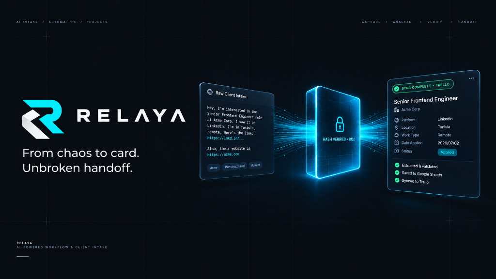

<p align="center">
  
</p>

<p align="center">
  <strong>From chaos to card. Unbroken handoff.</strong><br>
  An AI-powered client intake orchestration engine that converts raw, unstructured requests into verified project handoffs.
</p>

<p align="center">
  
  
  
  
  
  
  
</p>

---

## ⚡ The Concept

Raw client intake is messy: scattered emails, chat messages, unstructured briefs, and contradictory requirements. Teams waste hours parsing briefs and manually creating tickets, often hallucinating deliverables or missing critical constraints.

**Relaya** bridges the gap between chaotic intake and execution through a verified 4-step pipeline:

```
[ CAPTURE ] ──▶ [ ANALYZE ] ──▶ [ VERIFY ] ──▶ [ HANDOFF ]
 Raw Intake       AI Extraction    Hash Binding     Board Write
```

1. **Capture**: Ingest raw, unstructured intake text from emails, forms, or messages.
2. **Analyze**: AI parses objectives, deliverables, constraints, budget, timelines, and proposed task checklists. Every extracted item is mapped to a **source excerpt**; unmentioned fields are strictly flagged as **unknown**, never fabricated.
3. **Verify**: The reviewer edits and signs off on the draft. The sign-off binds cryptographically to a **SHA-256 content hash**. If the draft is edited after approval, the approval is **instantly invalidated**.
4. **Handoff**: A single approved card + task checklist is written to the destination board (Trello) with strict **idempotency guards** preventing duplicate cards.

---

## ✨ Key Features

- **Source-Backed AI Extraction**: Every extracted deliverable or constraint cites exact phrases from the raw intake. Zero hallucination policy: missing details are explicitly flagged.
- **Cryptographic Approval Integrity**: Approval is locked to a content hash. No board write can execute against an invalidated or outdated draft.
- **AI Cost & Token Safeguards**: Hardware-level guardrails checking per-call token caps (`MAX_TOKENS_PER_CALL`) and monthly expenditure (`MONTHLY_BUDGET_USD`) before any LLM invocation.
- **Immutable Audit Trail**: Every status transition (`INTAKE_SUBMITTED` &rarr; `ANALYSIS_READY` &rarr; `APPROVED` &rarr; `WRITE_SUCCESS`) is logged with timestamps and actor IDs.
- **Real-Time SSE Streaming**: Server-Sent Events with exponential backoff for live analysis updates without polling.
- **Modern Angular 22 Architecture**: Zoneless change detection (`provideZonelessChangeDetection`), Signal-based reactive state, and clean standalone component tree.

---

## 🛠️ Architecture & Tech Stack

```
┌────────────────────────────────────────────────────────┐
│                   Angular 22 Frontend                  │
│       (Zoneless · Signals · Standalone Components)     │
└───────────────────────────┬────────────────────────────┘
                            │ REST / SSE
┌───────────────────────────▼────────────────────────────┐
│              Spring Boot 4 (Hexagonal Core)            │
│  ┌───────────────────────┬──────────────────────────┐  │
│  │ Intake & Versioning   │ Review & Hash Binding    │  │
│  ├───────────────────────┼──────────────────────────┤  │
│  │ ProviderAdapter (Groq)│ BoardConnector (Trello)  │  │
│  └───────────────────────┴──────────────────────────┘  │
└─────────────┬───────────────────────────┬──────────────┘
              │                           │
┌─────────────▼─────────────┐ ┌───────────▼──────────────┐
│   PostgreSQL + Flyway     │ │     AI & Board APIs      │
│  (Multi-tenant Schema)    │ │ (Groq LLM · Trello API)  │
└───────────────────────────┘ └──────────────────────────┘
```

| Layer | Technology | Details |
|---|---|---|
| **Frontend** | Angular 22 | Standalone, Zoneless, Signals (`model`, `computed`, `effect`), SCSS |
| **Backend** | Java 21 · Spring Boot 4 | Hexagonal (Ports & Adapters), Spring Security, Flyway |
| **Database** | PostgreSQL | Multi-tenant schema, automated Flyway migrations |
| **AI Provider** | Groq (`ProviderAdapter`) | `llama-3.3-70b-versatile` abstracted behind provider port |
| **Board** | Trello (`BoardConnector`) | Idempotent card & checklist generator (with dev stub mode) |
| **Security** | JWT + Bucket4j | 60-min access tokens, refresh rotation, rate limiting |
| **Deployment** | Netlify / Render / Docker | Frontend on Netlify, containerized backend ready |

---

## 🚀 Getting Started

### Prerequisites
- Java 21 JDK
- Node.js 20+ & npm
- Docker & Docker Compose (for PostgreSQL)

### 1. Start PostgreSQL
```bash
docker compose up -d
```

### 2. Run Backend
```bash
cd backend
./mvnw spring-boot:run
```
*The backend starts at `http://localhost:8082`. Flyway automatically runs all database migrations and seeds pilot accounts.*

### 3. Run Frontend
```bash
cd frontend
npm install
npm start
```
*The Angular UI starts at `http://localhost:4200` and automatically proxies `/api` to the backend.*

---

## 🔑 Demo Seed Accounts

The initial database seed provisions two test roles (password is `changeit` for both):

| Role | Email | Password | Permissions |
|---|---|---|---|
| **Admin** | `admin@relaya.demo` | `changeit` | Full access: Intake, Review, Usage Dashboard, User Management |
| **Reviewer** | `reviewer@relaya.demo` | `changeit` | Submit intakes, review drafts, sign off approvals, trigger board write |

---

## 🌐 Online Demo Deployment (Netlify)

The frontend includes configuration ready for 1-click Netlify deployment:
1. Connect this repository to **[Netlify](https://app.netlify.com)**.
2. Netlify reads [`netlify.toml`](file:///c:/Users/MSI/projects/relaya/netlify.toml) automatically:
   - **Base directory**: `frontend`
   - **Build command**: `npm run build`
   - **Publish directory**: `dist/frontend-app/browser`
3. Hit **Deploy Site**.

---

## 📜 License & Context

Demonstration project created to showcase structured client intake orchestration, cryptographic review verification, and automated board handoff.